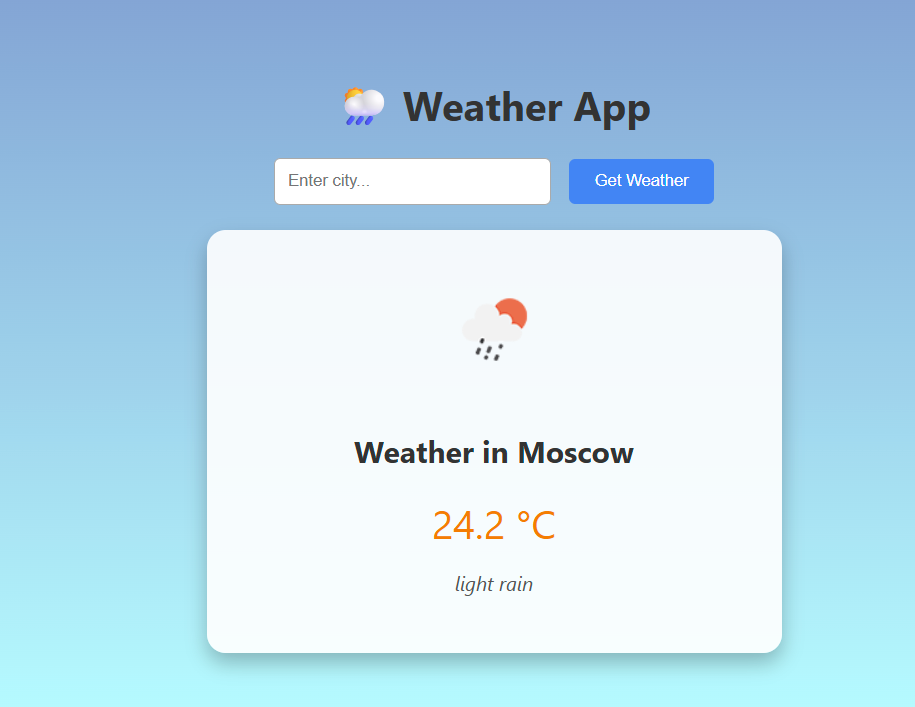

## Real-Time Weather App 🌤️

A Spring Boot backend + Thymeleaf frontend web app that fetches real-time weather data from OpenWeatherMap API based on user input city and displays temperature, weather description, and icon dynamically.

**Features**

- RESTful API endpoint /weather?city=CityName to fetch weather data

- User-friendly UI at /weather-ui built with Thymeleaf

- Displays temperature in Celsius, weather description, and an icon

- Gracefully handles invalid or empty city input

- API key managed securely via application.properties

- Uses Spring’s RestTemplate for HTTP calls

- JSON parsing done with Jackson’s ObjectMapper

**Technologies Used**
- Java 17+ / Spring Boot 3.5.x

- Thymeleaf for server-side HTML rendering

- OpenWeatherMap API

- Maven for build and dependency management

- Jackson for JSON parsing

**Getting Started**

Prerequisites

- Java JDK 17 or higher
- Maven 3.x
- An OpenWeatherMap API key (sign up here)

Setup
1. Clone the repository

git clone https://github.com/ravrranj/weather-app
cd weather-app

2. Add your OpenWeatherMap API key in src/main/resources/application.properties:

weather.api.key=YOUR_API_KEY_HERE

3. Build and run the project

mvn spring-boot:run

4. Open your browser at:

http://localhost:8080/weather-ui?city=Bengaluru

**Screenshots**

Future Improvements ✌️

Add frontend form for input instead of URL param

Better error handling and user feedback

Responsive design for mobile devices

Deploy to a cloud provider for public access

Author
Ravi Ranjan 🌤️ — [GitHub Profile](https://github.com/ravrranj)